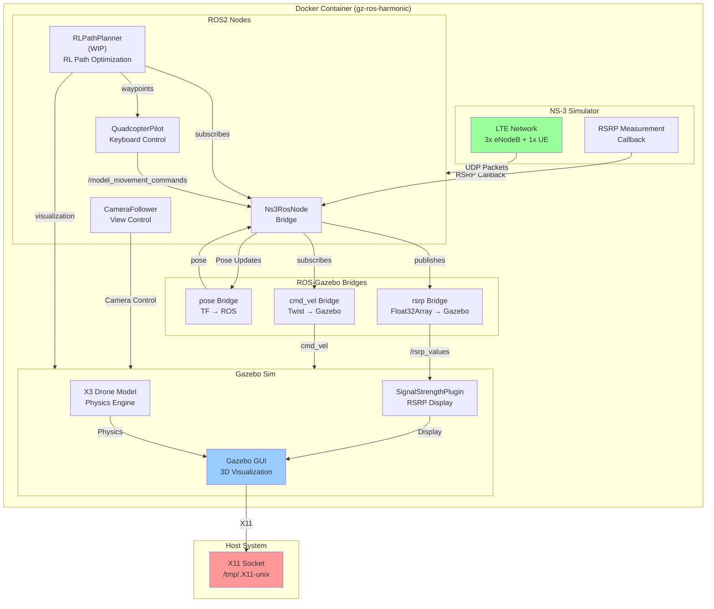

# NS3-Gazebo-ROS2 Integrated LTE Network Simulation

A real-time integrated simulation platform combining NS-3 LTE network simulation with Gazebo drone simulation and ROS2 orchestration. This system simulates an LTE network with three eNodeBs and a mobile UE (drone) that responds to network conditions, with live RSRP visualization in Gazebo.

**Key Architectural Detail**: The drone is **not directly controlled** by the pilot script. Instead, the `QuadcopterPilot` node sends commands to a remote server in the NS-3 simulation, which then routes those commands **through the simulated LTE network and eNodeBs** to reach the UE (drone). This means the drone's movement is dependent on network connectivity and signal quality—if the UE loses coverage or experiences poor RSRP, commands may not reach it.

## Overview

This project runs **entirely in Docker** and requires the host system to support X11 forwarding. The system integrates three major components:

- **NS-3 (Network Simulator)**: Simulates LTE network with 3 eNodeBs and 1 UE in real-time mode
- **Gazebo**: Provides 3D drone simulation with live RSRP signal strength visualization
- **ROS2**: Orchestrates communication between NS-3 and Gazebo through bridge nodes

## System Architecture



## Components

### 1. NS-3 LTE Network Simulator (`ns3_ros_node`)

Simulates a realistic LTE network in real-time mode:

- **3 eNodeBs** (Base Stations) positioned in a triangle formation
  - eNodeB 0 at (0, 0, 0)
  - eNodeB 1 at (150, 0, 0)
  - eNodeB 2 at (75, 150, 0)
- **1 UE** (User Equipment / Drone) that moves in the network
- **RSRP Measurements**: Reference Signal Received Power reported at 50ms intervals
- **Bidirectional UDP Communication**: 
  - Downlink: Receives movement commands from remote server
  - Uplink: Sends RSRP values and status updates

The NS-3 simulator runs in real-time mode, meaning simulation time advances at the same rate as wall-clock time, enabling synchronized interaction with Gazebo.

### 2. Gazebo Simulation (`gazebo_sim`)

Provides 3D physics simulation of the drone:

- **X3 Drone Model**: Full 6-DOF quadcopter with physics
- **SignalStrengthPlugin**: Custom Gazebo GUI plugin displaying live RSRP values from all eNodeBs
- **Real-time Synchronization**: Drone position updates are fed back to NS-3 via pose bridge

### 3. ROS2 Bridge Layer

Connects the discrete simulations through topic bridges and custom orchestration:

#### Bridge Nodes

| Bridge | Source | Destination | Purpose |
|--------|--------|-------------|---------|
| `cmd_vel_bridge` | ROS `/X3/cmd_vel` | Gazebo `/X3/cmd_vel` | Movement commands to drone |
| `pose_bridge` | Gazebo `/model/X3/pose` | ROS `/model/X3/pose` | Drone position feedback |
| `rsrp_bridge` | ROS `/rsrp_values` | Gazebo `/rsrp_values` | Signal strength to GUI |

#### Control Nodes

- **`QuadcopterPilot`**: Keyboard input node for manual drone control
  - `W/↑`: Move forward
  - `S/↓`: Move backward
  - `A/←`: Rotate counter-clockwise
  - `D/→`: Rotate clockwise
  - `Q`: Ascend
  - `E`: Descend
  - `ESC`: Exit

- **`CameraFollower`**: Automatically positions camera to follow drone

- **`Ns3RosNode`**: Bidirectional bridge between NS-3 and ROS
  - Publishes RSRP measurements
  - Receives movement commands and forwards to NS-3 over UDP
  - Synchronizes drone position from Gazebo to NS-3 mobility model

- **`RLPathPlanner`** ⚠️ **[WORK IN PROGRESS]**: Reinforcement learning-based path optimization
  - Subscribes to RSRP values, network congestion metrics, and handover events
  - Uses RL agent to compute optimal waypoint sequences that:
    - Minimize handovers between eNodeBs (reduce connection switching overhead)
    - Avoid network congestion zones (stay in areas with good coverage and low load)
    - Maximize signal quality along the trajectory
  - Publishes waypoint geometry as `visualization_msgs/MarkerArray` for Gazebo display
  - Generates suggested heading and velocity commands that `QuadcopterPilot` can optionally follow
  - **Status**: Currently in development; core RL training pipeline not yet implemented

## Data Flow (Network-Mediated Control)

1. **User Input** → `QuadcopterPilot` (keyboard)
2. **Movement Command** (`Twist` msg) → Ns3RosNode over ROS topic
3. **Ns3RosNode** → Serializes Twist as UDP packet and sends to **remote server in NS-3** (not directly to UE)
4. **NS-3 Remote Server** → Receives packet on uplink from eNodeB
5. **NS-3 Remote Server** → Creates downlink UDP packet with movement command
6. **NS-3 eNodeBs** → Route packet through LTE network to UE based on coverage and RSRP
7. **NS-3 UE** → Receives command packet (only if connected to an eNodeB with sufficient signal)
8. **NS-3 UE** → Updates drone position based on received command
9. **NS-3 RSRP Measurement** → Callback triggers, records signal strength from all eNodeBs
10. **Ns3RosNode** → Publishes `/rsrp_values` topic (Float32Array)
11. **rsrp_bridge** → Converts to Gazebo transport message
12. **SignalStrengthPlugin** → Displays RSRP values in Gazebo GUI
13. **Gazebo Physics** → Drone moves, publishes pose
14. **pose_bridge** → Sends pose back to ROS
15. **Ns3RosNode** → Updates UE position in NS-3 mobility model

This closed-loop synchronization keeps the network simulation and visual simulation in sync. **Critical: Drone commands must traverse the simulated LTE network, so loss of signal or poor RSRP can prevent commands from reaching the drone.**

## Prerequisites

### Host System

- **Linux** (Ubuntu 20.04+ recommended)
- **Docker** with X11 support
- **X11 Server** running on the host (required for GUI forwarding)
  - Most Linux systems have this by default
  - For WSL2 on Windows, use Xvfb or similar
- **Docker Compose** (optional, for simplified execution)

### X11 Requirement

**This entire system runs in Docker and displays through X11 forwarding.** Your host must support X11 for Gazebo GUI to appear. Without X11, you can still run the simulation headless, but the 3D visualization won't be visible.

## Installation & Execution

### Build Docker Image

```bash
docker build -t gz-ros-harmonic .
```

### Run the Simulation

Before running, allow local Docker connections to your X11 server:

```bash
xhost +local:docker
```

Then execute with the provided startup script:

```bash
./variables.sh
# This sources environment variables and runs:

docker run -ti \
  --privileged \
  --rm \
  -u root:root \
  --name gazebo-sim \
  --group-add video \
  --device /dev/dri:/dev/dri \
  -e DISPLAY=$DISPLAY \
  -e XDG_RUNTIME_DIR=/run/user/0 \
  -e QT_X11_NO_MITSHM=1 \
  -e MESA_GL_VERSION_OVERRIDE=4.5 \
  -e MESA_GLSL_VERSION_OVERRIDE=450 \
  -e LIBGL_ALWAYS_INDIRECT=0 \
  -v /tmp/.X11-unix:/tmp/.X11-unix:rw \
  -v $(pwd)/sim_and_bridge_clean.launch.py:/tmp/sim_and_bridge.launch.py \
  -v $(pwd)/worlds/world.sdf:/app/world.sdf \
  -v $(pwd)/debugger_config.config:/app/debugger_config.config \
  -v $(pwd)/network_animations/:/app/network_animations/ \
  gz-ros-harmonic \
  bash -c "mkdir -p /run/user/0 && chmod 0700 /run/user/0 && \
           source /opt/ros/jazzy/setup.bash && \
           source /app/install/setup.bash && \
           ros2 launch /tmp/sim_and_bridge.launch.py"
```

**Important**: The command must run `ros2 launch` in the **foreground** (not backgrounded with `&`). This ensures keyboard input is properly routed to the ROS nodes.

### Mount Points

| Host Path | Container Path | Purpose |
|-----------|-----------------|---------|
| `/tmp/.X11-unix` | `/tmp/.X11-unix` | X11 socket for GUI |
| `./sim_and_bridge_clean.launch.py` | `/tmp/sim_and_bridge.launch.py` | Launch configuration |
| `./worlds/world.sdf` | `/app/world.sdf` | Gazebo world definition |
| `./debugger_config.config` | `/app/debugger_config.config` | Gazebo GUI layout config |
| `./network_animations/` | `/app/network_animations/` | NS-3 animation output |

## Usage

Once the system starts:

1. **Gazebo Window** opens showing the drone and eNodeB positions
2. **RSRP Monitor** widget displays signal strength from each base station in real-time
3. **Keyboard Control**: Use keys to move the drone around the network
4. **Observe Simulation**: RSRP values change as the drone moves through coverage areas

### Example Interaction

```
$ ros2 launch /tmp/sim_and_bridge.launch.py
[INFO] Gazebo started...
[INFO] Keyboard controller started. Use arrow keys or WASD. Press ESC to quit.
[INFO] NS3 simulator running in real-time...
```

Press `W` to move the drone forward. Watch the RSRP values in the GUI change based on proximity to eNodeBs. The network simulation and visual simulation update in lockstep.

## Configuration Files

### `world.sdf`
Defines the Gazebo world: drone model, environment, and sensor configurations.

### `debugger_config.config`
Gazebo GUI layout configuration specifying which plugins and views are displayed.

### `sim_and_bridge_clean.launch.py`
ROS2 launch file that orchestrates all nodes:
- Starts Gazebo simulator
- Launches bridge nodes (cmd_vel, pose, rsrp)
- Starts NS-3 ROS node
- Starts keyboard controller and camera follower

## Network Animation

NS-3 generates animation files in `./network_animations/ns3_ros2.xml` that can be replayed using NetAnim to visualize network topology and packet flow after the simulation ends.

## Troubleshooting

### Gazebo Window Doesn't Appear
- Verify X11 is running: `echo $DISPLAY` should show `:0` or similar
- Run `xhost +local:docker` before starting container
- Check that `/tmp/.X11-unix` is properly mounted

### Keyboard Input Not Working
- **Most Common**: Launch file is running nodes in background (`&`). Remove the `&` to keep launch in foreground.
- Ensure focus is on terminal where docker run was executed
- Try pressing keys in the Gazebo window directly (if it has focus)

### RSRP Values Not Updating
- Verify NS-3 node is running: check `ros2 node list`
- Check rsrp_bridge status: `ros2 topic echo /rsrp_values`
- Ensure drone is within coverage area of at least one eNodeB

### Docker Permission Errors
- Run `xhost +local:docker` to allow Docker to access X11
- Use `--privileged` flag in docker run (already in script)

## Performance Tuning

- **NS-3 Simulation Speed**: Adjust in ns3 code or launch parameters
- **Gazebo Physics Step**: Configure in `world.sdf`
- **ROS2 Update Rates**: Modify timer periods in individual nodes

## Work In Progress: RLPathPlanner Node

An autonomous path planning system using reinforcement learning is currently under development. This node will:

### Objectives
- **Minimize Handovers**: Learn trajectories that reduce unnecessary cell switches between eNodeBs
- **Avoid Congestion**: Dynamically route around high-load network zones
- **Maximize Signal Quality**: Maintain good RSRP throughout the flight path
- **Real-time Adaptation**: Update waypoints as network conditions change

### Architecture
- **State Space**: Drone position, RSRP from each eNodeB, network load, handover history
- **Action Space**: Discrete waypoint selection in a grid around the drone
- **Reward Function**: 
  - Positive: High RSRP, long time between handovers
  - Negative: Low signal, excessive handovers, congestion
- **Output**: Visualization of waypoints in Gazebo as interactive markers; suggested heading and velocity for pilot

### Integration with QuadcopterPilot
The `RLPathPlanner` publishes suggested waypoints that appear as visual markers in Gazebo. The `QuadcopterPilot` can optionally follow these suggestions by autopilot, or continue with manual keyboard control for comparison.

### Current Status
⚠️ **Early Development** — The framework for subscribing to network metrics and publishing waypoints is in place. Core RL training pipeline (model training, policy gradient updates) is not yet implemented.

### Future Enhancements
- Deep Q-Network (DQN) or Policy Gradient training with simulated trajectories
- Multi-drone coordination
- Integration with actual network load prediction models
- Handover impact quantification from NS-3 traces

## Future Extensions (Beyond Current Scope)

- Add UAV collision avoidance with other drones
- Support multiple drones with coordinated path planning
- Add real LTE protocol simulation details (beyond RSRP)
- Integrate with actual drone hardware via middleware
- Data logging and post-simulation analysis toolsone hardware via middleware Integrate with actual drone hardware via middleware
