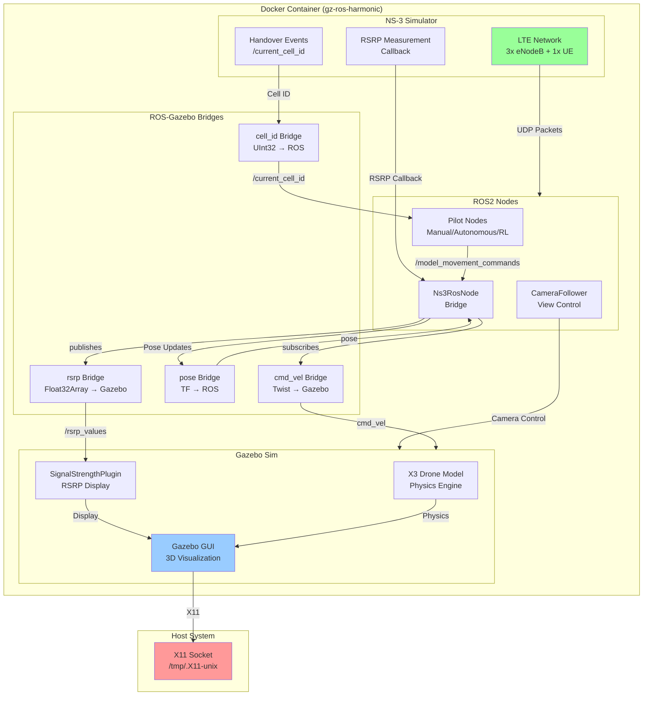

# NS3-Gazebo-ROS2 Integrated LTE Network Simulation

A real-time integrated simulation platform combining NS-3 LTE network simulation with Gazebo drone simulation and ROS2 orchestration. This system simulates an LTE network with three eNodeBs and a mobile UE (drone) that responds to network conditions, with live RSRP visualization in Gazebo.

**Key Architectural Detail**: The drone is **not directly controlled** by the pilot script. Instead, pilot nodes send commands to a remote server in the NS-3 simulation, which then routes those commands **through the simulated LTE network and eNodeBs** to reach the UE (drone). This means the drone's movement is dependent on network connectivity and signal quality—if the UE loses coverage or experiences poor RSRP, commands may not reach it.

## Overview

This project runs **entirely in Docker** and requires the host system to support X11 forwarding. The system integrates three major components:

- **NS-3 (Network Simulator)**: Simulates LTE network with 3 eNodeBs and 1 UE in real-time mode
- **Gazebo**: Provides 3D drone simulation with live RSRP signal strength visualization
- **ROS2**: Orchestrates communication between NS-3 and Gazebo through bridge nodes

## System Architecture



## Components

### 1. NS-3 LTE Network Simulator (`ns3_ros_node`)

Simulates a realistic LTE network in real-time mode:

- **3 eNodeBs** (Base Stations) positioned in a triangle formation to provide coverage across the simulation area
- **1 UE** (User Equipment / Drone) that moves in the network
- **RSRP Measurements**: Reference Signal Received Power reported at 50ms intervals
- **Handover Events**: Publishes current serving cell ID on `/current_cell_id` topic
- **Bidirectional UDP Communication**: 
  - Downlink: Receives movement commands from remote server
  - Uplink: Sends RSRP values and status updates

The NS-3 simulator runs in real-time mode, meaning simulation time advances at the same rate as wall-clock time, enabling synchronized interaction with Gazebo.

### 2. Gazebo Simulation (`gazebo_sim`)

Provides 3D physics simulation of the drone:

- **X3 Drone Model**: Full 6-DOF quadcopter with physics
- **SignalStrengthPlugin**: Custom Gazebo GUI plugin displaying live RSRP values from all eNodeBs
- **Real-time Synchronization**: Drone position updates are fed back to NS-3 via pose bridge
- **World Files**: 
  - `world.sdf`: Basic world without waypoints (used for RL training/testing)
  - `world_with_waypoints.sdf`: World with waypoint markers (used for manual/autonomous/diagonal modes)

### 3. ROS2 Bridge Layer

Connects the discrete simulations through topic bridges and custom orchestration:

#### Bridge Nodes

| Bridge | Source | Destination | Purpose |
|--------|--------|-------------|---------|
| `cmd_vel_bridge` | ROS `/X3/cmd_vel` | Gazebo `/X3/cmd_vel` | Movement commands to drone |
| `pose_bridge` | Gazebo `/model/X3/pose` | ROS `/model/X3/pose` | Drone position feedback |
| `rsrp_bridge` | ROS `/rsrp_values` | Gazebo `/rsrp_values` | Signal strength to GUI |
| `cell_id_bridge` | ROS `/current_cell_id` | Gazebo `/current_cell_id` | Handover notifications |

#### Control Nodes (Pilot Modes)

The system supports multiple pilot modes, selectable via the `control_mode` launch argument:

##### 1. **Manual Control** (`control_mode:=manual`)
- **Node**: `QuadcopterPilot`
- **Description**: Keyboard-based manual control
- **Controls**:
  - `W/↑`: Move forward
  - `S/↓`: Move backward
  - `A/←`: Rotate counter-clockwise
  - `D/→`: Rotate clockwise
  - `Q`: Ascend
  - `E`: Descend
  - `ESC`: Exit
- **World File**: `world_with_waypoints.sdf` (auto-selected)

##### 2. **Autonomous Waypoint Pilot** (`control_mode:=autonomous`)
- **Node**: `AutonomousPilot` (WaypointPilot)
- **Description**: Follows a predefined L-shaped waypoint path to avoid dead zones
- **Path**: Navigates from source to destination via waypoints
- **Features**: 
  - Logs connectivity metrics (RSRP, handovers, ping-pongs)
  - Saves results to JSON for comparison with RL agent
- **World File**: `world_with_waypoints.sdf` (auto-selected)

##### 3. **Diagonal Pilot** (`control_mode:=diagonal`)
- **Node**: `DiagonalPilot`
- **Description**: Flies a direct diagonal path from start to goal
- **Path**: Straight diagonal route from source to destination
- **Features**:
  - Logs all connectivity metrics for baseline comparison
  - Detects ping-pong handovers
  - Saves results to JSON
- **World File**: `world_with_waypoints.sdf` (auto-selected)

##### 4. **RL Training Pilot** (`control_mode:=rl`)
- **Node**: `RLPilot` (ConnectivityAwareRLPilot)
- **Description**: Reinforcement learning agent that learns optimal paths through Q-learning
- **Algorithm**: Q-Learning with connectivity-aware rewards
- **Features**:
  - Learns to minimize handovers and maintain good signal quality
  - Saves Q-table after training
  - Logs training history to JSON
- **World File**: `world.sdf` (auto-selected, no waypoints)

##### 5. **RL Test Pilot** (`control_mode:=rl_test`)
- **Node**: `RLTest`
- **Description**: Evaluates trained Q-table with pure exploitation (ε=0)
- **Features**:
  - Loads latest trained Q-table automatically
  - Runs test episodes and generates statistics
  - Saves test results to JSON
- **World File**: `world.sdf` (auto-selected, no waypoints)

##### 6. **Camera Follower** (Optional)
- **Node**: `CameraFollower`
- **Description**: Automatically positions camera to follow drone
- **Status**: Currently commented out in launch file

#### Core Bridge Node

- **`Ns3RosNode`**: Bidirectional bridge between NS-3 and ROS
  - Publishes RSRP measurements on `/rsrp_values`
  - Publishes handover events on `/current_cell_id`
  - Receives movement commands and forwards to NS-3 over UDP
  - Synchronizes drone position from Gazebo to NS-3 mobility model

## Reinforcement Learning Algorithm

The RL pilot uses **Q-Learning**, a model-free off-policy reinforcement learning algorithm, to learn optimal navigation policies that balance path efficiency with network connectivity quality.

### Algorithm Overview

**Q-Learning** is a value-based RL method that learns the optimal action-value function Q(s,a), representing the expected cumulative reward of taking action `a` in state `s` and following the optimal policy thereafter.

### State Space

The state representation is a tuple: `(grid_x, grid_y, serving_cell, distance_band, signal_quality)`

- **grid_x, grid_y**: Discrete grid coordinates (15m × 15m cells)
- **serving_cell**: Current eNodeB ID (0, 1, or 2)
- **distance_band**: Categorical distance to goal (`'very_close'`, `'close'`, `'medium'`, `'far'`)
- **signal_quality**: Categorical RSRP quality (`'excellent'`, `'good'`, `'fair'`, `'poor'`)

### Action Space

8 discrete directional actions:
- Cardinal: `north`, `south`, `east`, `west`
- Diagonal: `northeast`, `northwest`, `southeast`, `southwest`

### Reward Function

The reward function is multi-objective, encouraging:
1. **Progress toward goal**: Distance-based shaping reward (15-30× distance improvement)
2. **Signal quality**: 
   - +2.0 for excellent RSRP (> -85 dBm)
   - +1.0 for good RSRP (> -90 dBm)
   - -3.0 penalty for poor RSRP (< -95 dBm)
3. **Handover efficiency**: 
   - Heavy penalty (-50.0) for ping-pong handovers
   - No penalty for normal handovers
   - Bonus at goal: +200 (0 HOs), +100 (≤2 HOs), +50 (≤5 HOs)
4. **Altitude tracking**: Reward for maintaining target altitude (25m)
5. **Heading alignment**: Reward for moving toward goal direction
6. **Goal achievement**: +500 base bonus when reaching destination
7. **Time penalty**: -0.15 per step to encourage efficiency

### Q-Learning Update Rule

```
Q(s, a) ← Q(s, a) + α[r + γ max Q(s', a') - Q(s, a)]
```

Where:
- **α (alpha)**: Learning rate = 0.25
- **γ (gamma)**: Discount factor = 0.95
- **r**: Immediate reward
- **s'**: Next state after taking action `a` in state `s`

### Exploration Strategy

**Epsilon-greedy** exploration with decay:
- Initial ε = 0.3 (30% exploration)
- Decay rate = 0.96 per episode
- Minimum ε = 0.1 (maintains 10% exploration)

### Training Process

1. Agent starts at source position
2. At each step (5 Hz):
   - Observes current state (position, cell, signal quality)
   - Selects action using ε-greedy policy
   - Executes action (moves drone)
   - Receives reward based on progress, signal quality, handovers
   - Updates Q-table using Q-learning rule
3. Episode terminates when:
   - Goal reached (within 12m threshold)
   - Timeout (500 steps or no progress for 8 seconds)
4. Q-table is saved after training to `/app/models/q_table_*.pkl`
5. Training history is logged to `/app/logs/history_*.json`

### Key Features

- **Connectivity-aware**: Rewards maintaining good RSRP and penalizes poor signal
- **Handover optimization**: Learns to minimize unnecessary handovers and avoid ping-pongs
- **Progressive timeout**: Detects actual progress, not just step count
- **Goal-directed initialization**: New states initialized with heuristic bias toward goal

## Data Flow (Network-Mediated Control)

1. **Pilot Node** → Generates movement command (`Twist` msg)
2. **Movement Command** → Published to `/model_movement_commands` topic
3. **Ns3RosNode** → Subscribes to command, serializes as UDP packet
4. **NS-3 Remote Server** → Receives packet on uplink from eNodeB
5. **NS-3 Remote Server** → Creates downlink UDP packet with movement command
6. **NS-3 eNodeBs** → Route packet through LTE network to UE based on coverage and RSRP
7. **NS-3 UE** → Receives command packet (only if connected to an eNodeB with sufficient signal)
8. **NS-3 UE** → Updates drone position based on received command
9. **NS-3 RSRP Measurement** → Callback triggers, records signal strength from all eNodeBs
10. **NS-3 Handover Detection** → Publishes current cell ID when handover occurs
11. **Ns3RosNode** → Publishes `/rsrp_values` (Float32Array) and `/current_cell_id` (UInt32)
12. **Bridges** → Convert ROS messages to Gazebo transport
13. **SignalStrengthPlugin** → Displays RSRP values in Gazebo GUI
14. **Gazebo Physics** → Drone moves, publishes pose
15. **pose_bridge** → Sends pose back to ROS
16. **Ns3RosNode** → Updates UE position in NS-3 mobility model

This closed-loop synchronization keeps the network simulation and visual simulation in sync. **Critical: Drone commands must traverse the simulated LTE network, so loss of signal or poor RSRP can prevent commands from reaching the drone.**

## Prerequisites

### Host System

- **Linux** (Ubuntu 20.04+ recommended)
- **Docker** with X11 support
- **X11 Server** running on the host (required for GUI forwarding)
  - Most Linux systems have this by default
  - For WSL2 on Windows, use Xvfb or similar
- **Docker Compose** (optional, for simplified execution)

### X11 Requirement

**This entire system runs in Docker and displays through X11 forwarding.** Your host must support X11 for Gazebo GUI to appear. Without X11, you can still run the simulation headless, but the 3D visualization won't be visible.

## Installation & Compilation

### Build Docker Image

The Docker image contains all dependencies and builds all components:

```bash
docker build -t gz-ros-harmonic .
```

**Build Process** (executed inside Docker during image build):

1. **System Dependencies**: Installs Gazebo, ROS2 Jazzy, NS-3, colcon, ninja
2. **NS-3 Compilation**: 
   - Configures NS-3 with required modules (LTE, mobility, propagation, etc.)
   - Builds NS-3 using Ninja build system
   - Location: `/app/ns3-source/`
3. **ROS2 Workspace Setup**:
   - Creates `ros_network` package (C++ node for NS-3 bridge)
   - Creates `remote_server_nodes` package (Python pilot nodes)
   - Compiles C++ nodes using colcon
   - Installs Python packages with entry points
4. **Gazebo Plugin Compilation**:
   - Builds custom SignalStrengthPlugin (C++/QML)
   - Installs plugin to Gazebo plugin directory

**Note**: The entire build process happens during `docker build`, so no additional compilation is needed after the image is built.

### Run the Simulation

Before running, allow local Docker connections to your X11 server:

```bash
xhost +local:docker
```

Then execute with the provided startup script:

```bash
./variables.sh
# This sources environment variables and runs:

docker run -ti \
  --privileged \
  --rm \
  -u root:root \
  --name gazebo-sim \
  --group-add video \
  --device /dev/dri:/dev/dri \
  -e DISPLAY=$DISPLAY \
  -e XDG_RUNTIME_DIR=/run/user/0 \
  -e QT_X11_NO_MITSHM=1 \
  -e MESA_GL_VERSION_OVERRIDE=4.5 \
  -e MESA_GLSL_VERSION_OVERRIDE=450 \
  -e LIBGL_ALWAYS_INDIRECT=0 \
  -v /tmp/.X11-unix:/tmp/.X11-unix:rw \
  -v $(pwd)/sim_and_bridge_clean.launch.py:/tmp/sim_and_bridge.launch.py \
  -v $(pwd)/worlds/world.sdf:/app/world.sdf \
  -v $(pwd)/worlds/world_with_waypoints.sdf:/app/world_with_waypoints.sdf \
  -v $(pwd)/debugger_config.config:/app/debugger_config.config \
  -v $(pwd)/network_animations/:/app/network_animations/ \
  gz-ros-harmonic \
  bash -c "mkdir -p /run/user/0 && chmod 0700 /run/user/0 && \
           source /opt/ros/jazzy/setup.bash && \
           source /app/install/setup.bash && \
           ros2 launch /tmp/sim_and_bridge.launch.py control_mode:=manual"
```

**Important**: The command must run `ros2 launch` in the **foreground** (not backgrounded with `&`). This ensures keyboard input is properly routed to the ROS nodes.

### Mount Points

| Host Path | Container Path | Purpose |
|-----------|-----------------|---------|
| `/tmp/.X11-unix` | `/tmp/.X11-unix` | X11 socket for GUI |
| `./sim_and_bridge_clean.launch.py` | `/tmp/sim_and_bridge.launch.py` | Launch configuration |
| `./worlds/world.sdf` | `/app/world.sdf` | Gazebo world (RL modes) |
| `./worlds/world_with_waypoints.sdf` | `/app/world_with_waypoints.sdf` | Gazebo world (other modes) |
| `./debugger_config.config` | `/app/debugger_config.config` | Gazebo GUI layout config |
| `./network_animations/` | `/app/network_animations/` | NS-3 animation output |

## Usage

### Selecting Pilot Mode

The launch file automatically selects the appropriate world file and pilot node based on the `control_mode` argument:

**Manual Control** (default):
```bash
ros2 launch /tmp/sim_and_bridge.launch.py control_mode:=manual
```

**Autonomous Waypoint Pilot**:
```bash
ros2 launch /tmp/sim_and_bridge.launch.py control_mode:=autonomous
```

**Diagonal Direct Path**:
```bash
ros2 launch /tmp/sim_and_bridge.launch.py control_mode:=diagonal
```

**RL Training**:
```bash
ros2 launch /tmp/sim_and_bridge.launch.py control_mode:=rl
```

**RL Testing** (requires trained Q-table):
```bash
ros2 launch /tmp/sim_and_bridge.launch.py control_mode:=rl_test
```

**Manual World File Override**:
```bash
ros2 launch /tmp/sim_and_bridge.launch.py control_mode:=rl world_sdf_file:=/app/custom_world.sdf
```

### World File Auto-Selection

The launch file automatically selects world files based on control mode:
- **RL modes** (`rl`, `rl_test`): Uses `world.sdf` (no waypoints)
- **Other modes** (`manual`, `autonomous`, `diagonal`): Uses `world_with_waypoints.sdf` (with waypoints)

### Example Interaction

```
$ ros2 launch /tmp/sim_and_bridge.launch.py control_mode:=manual
[INFO] Gazebo started...
[INFO] Keyboard controller started. Use arrow keys or WASD. Press ESC to quit.
[INFO] NS3 simulator running in real-time...
```

Press `W` to move the drone forward. Watch the RSRP values in the GUI change based on proximity to eNodeBs. The network simulation and visual simulation update in lockstep.

### RL Training Workflow

1. **Train the agent**:
   ```bash
   ros2 launch /tmp/sim_and_bridge.launch.py control_mode:=rl
   ```
   - Trains for 50 episodes by default
   - Saves Q-table to `/app/models/q_table_*.pkl`
   - Saves training history to `/app/logs/history_*.json`

2. **Test the trained agent**:
   ```bash
   ros2 launch /tmp/sim_and_bridge.launch.py control_mode:=rl_test
   ```
   - Loads latest Q-table automatically
   - Runs 20 test episodes with ε=0 (pure exploitation)
   - Saves test results to `/app/logs/test_results_*.json`

3. **Generate plots** (optional):
   ```bash
   ros2 run remote_server_nodes rl_plotter \
     --training /app/logs/history_*.json \
     --testing /app/logs/test_results_*.json \
     --output /app/plots
   ```

## Configuration Files

### `world.sdf` / `world_with_waypoints.sdf`
Defines the Gazebo world: drone model, environment, eNodeB positions, and sensor configurations. The world file is automatically selected based on control mode.

### `debugger_config.config`
Gazebo GUI layout configuration specifying which plugins and views are displayed.

### `sim_and_bridge_clean.launch.py`
ROS2 launch file that orchestrates all nodes:
- Starts Gazebo simulator with appropriate world file
- Launches bridge nodes (cmd_vel, pose, rsrp, cell_id)
- Starts NS-3 ROS node
- Starts appropriate pilot node based on `control_mode` argument

## Network Animation

NS-3 generates animation files in `./network_animations/ns3_ros2.xml` that can be replayed using NetAnim to visualize network topology and packet flow after the simulation ends.

## Troubleshooting

### Gazebo Window Doesn't Appear
- Verify X11 is running: `echo $DISPLAY` should show `:0` or similar
- Run `xhost +local:docker` before starting container
- Check that `/tmp/.X11-unix` is properly mounted

### Keyboard Input Not Working
- **Most Common**: Launch file is running nodes in background (`&`). Remove the `&` to keep launch in foreground.
- Ensure focus is on terminal where docker run was executed
- Try pressing keys in the Gazebo window directly (if it has focus)

### RSRP Values Not Updating
- Verify NS-3 node is running: check `ros2 node list`
- Check rsrp_bridge status: `ros2 topic echo /rsrp_values`
- Ensure drone is within coverage area of at least one eNodeB

### RL Test Fails to Find Q-table
- Ensure you've trained a model first using `control_mode:=rl`
- Check that Q-table files exist in `/app/models/` directory
- Manually specify Q-table path: `ros2 run remote_server_nodes rl_test --qtable /app/models/q_table_YYYYMMDD_HHMMSS.pkl`

### Docker Permission Errors
- Run `xhost +local:docker` to allow Docker to access X11
- Use `--privileged` flag in docker run (already in script)

## Performance Tuning

- **NS-3 Simulation Speed**: Adjust in ns3 code or launch parameters
- **Gazebo Physics Step**: Configure in `world.sdf`
- **ROS2 Update Rates**: Modify timer periods in individual nodes
- **RL Training**: Adjust episodes, learning rate (α), discount factor (γ), and epsilon decay in `rl_pilot.py`

## Future Extensions (Beyond Current Scope)

- Add UAV collision avoidance with other drones
- Support multiple drones with coordinated path planning
- Add real LTE protocol simulation details (beyond RSRP)
- Integrate with actual drone hardware via middleware
- Data logging and post-simulation analysis tools
- Deep Q-Network (DQN) for larger state spaces
- Multi-drone coordination with shared Q-tables
